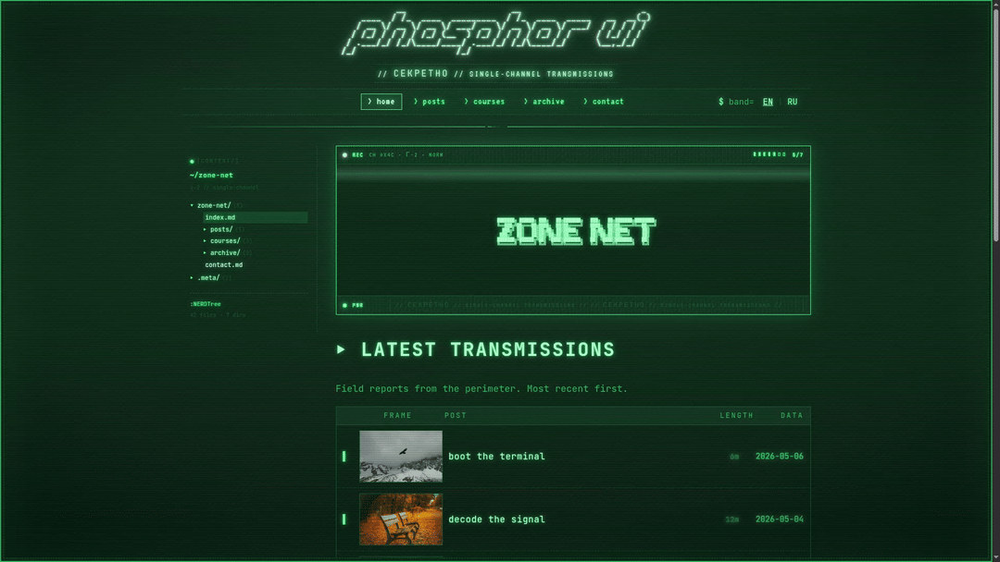

<div align="center">
<h1>phosphor-ui</h1>

<p>Single-channel green-phosphor React UI for personal wikis, blogs, digital gardens, project logs, and second brains.</p>

[](https://www.npmjs.com/package/@sektant1/phosphor-ui)
[](https://www.npmjs.com/package/@sektant1/phosphor-ui)
[](./LICENSE)
[](https://sektant1.github.io/phosphor)
[](https://www.typescriptlang.org)

</div>

---


<div align="center">
  
</div>

## Install

```bash
npm install @sektant1/phosphor-ui
```

Peer deps: `react ^17 || ^18 || ^19`, `react-dom ^17 || ^18 || ^19`.
`@mdx-js/react ^2 || ^3` is optional and only needed for `<PostBody>` / MDX rendering.

## Setup

Import the full stylesheet once at your app root:

```tsx
import "@sektant1/phosphor-ui/phosphor.css";
```

If you need finer control, import `tokens.css` and `global.css` separately.

## Tokens

Use the `--pho-*` tokens for app-level customization. The older raw tokens
(`--phosphor`, `--bg`, `--magenta`, etc.) still work, but the semantic names are
the stable consumer API.

```css
:root {
  --pho-color-background: #04140a;
  --pho-color-primary: #2cff7a;
  --pho-color-accent: #62ff9a;
  --pho-size-prose: 72ch;
}

.noteShell {
  max-width: var(--pho-size-prose);
  color: var(--pho-color-text);
  border: var(--pho-border-line);
  box-shadow: var(--pho-glow-primary-soft);
}
```

For TypeScript tooling, token names are exported from the package:

```ts
import { PHOSPHOR_TOKEN_GROUPS, phosphorVar } from "@sektant1/phosphor-ui";

const linkColor = phosphorVar("--pho-color-link");
```

## Quick start

```tsx
import { SiteShell, Post, Callout } from "@sektant1/phosphor-ui";
import "@sektant1/phosphor-ui/phosphor.css";

export default function App() {
  return (
    <SiteShell
      title="field notes"
      tagline="personal wiki / project log"
      nav={[
        { label: "notes", href: "/notes", active: true },
        { label: "projects", href: "/projects" },
      ]}
      footerLinks={[{ label: "rss", href: "/rss.xml" }]}
    >
      <Post
        title="Boot sequence"
        headerProps={{
          eyebrow: "log / systems",
          meta: { date: "2026-05-09", readTime: "3 min", tags: ["wiki"] },
        }}
      >
        <p>Use normal React or MDX content inside the post body.</p>
        <Callout title="signal">
          The shell includes a CRT frame, accessible skip link, header, content
          region, and footer.
        </Callout>
      </Post>
    </SiteShell>
  );
}
```

## Import Model

Use the root package for application code:

```tsx
import { SiteShell, Post, Button, Callout, TableOfContents } from "@sektant1/phosphor-ui";
```

The physical folders are organized for maintainers. Consumers should prefer the stable root exports so components can move internally without breaking your site.

## Components

| Group | Components |
|---|---|
| **Presets** | `SiteShell` |
| **Layout** | `CrtShell` `Header` `Footer` `HeroFrame` `NerdTree` `PdaWindow` `Post` |
| **Content** | `Prose` `PostBody` `Callout` `CodeBlock` `Hr` `Tag` `Text` `AsciiBanner` `TerminalPrompt` |
| **Lists** | `PostListing` `PostRow` `CourseCard` `LessonRow` `ModuleAccordion` `PrereqList` `Exercise` |
| **Nav** | `Breadcrumbs` `Pagination` `SeriesNav` `Stepper` `TableOfContents` `Link` |
| **Form** | `Button` `Input` `Textarea` `Checkbox` `Select` `Switch` `Badge` |
| **Feedback** | `ProgressBar` `ReadingRail` `StatPill` `Toast` `Tooltip` `VideoPlayer` |

## Recipes

### Course cards

```tsx
<CourseCard
  stamp="COURSE-01"
  thumbSrc="/images/course-frame.png"
  coverMeta="6 modules"
  tag="entry"
  title="Cold-boot operations"
  progress={{ value: 4, total: 6 }}
  cta={{ label: "resume", href: "/courses/cold-boot" }}
/>
```

For a compact text-only card, remove the cover column:

```tsx
<CourseCard showCover={false} title="Reference index" cta={{ label: "open", href: "/ref" }} />
```

### Admin editors

```tsx
<ContentEditor
  kindLabel="POST"
  autoSlug={{ from: "title", to: "slug" }}
  fields={[
    { kind: "text", key: "title", label: "TITLE" },
    { kind: "textarea", key: "body", label: "BODY", rows: 12 },
    { kind: "tags", key: "tags", label: "TAGS" },
  ]}
/>
```

## Personal Site Pattern

For blogs, digital gardens, and second brains, start with `SiteShell` and add pages with `Post`:

```tsx
<SiteShell title="notes" nav={navItems}>
  <Post title="Now page" sidebar={<TableOfContents items={toc} />}>
    <NowPageMdx />
  </Post>
</SiteShell>
```

Reach for lower-level components when you need custom app structure:

```tsx
<CrtShell>
  <Header title="lab" />
  <main>
    <NerdTree nodes={nodes} />
    <Prose>{children}</Prose>
  </main>
  <Footer brand="lab" />
</CrtShell>
```

## MDX posts

```tsx
import { PostBody } from "@sektant1/phosphor-ui";
import PostMdx from "./posts/boot.mdx";

<PostBody>
  <PostMdx />
</PostBody>
```

`PostBody` wraps content in `<Prose>` + `MDXProvider`. Native MDX tags (`h1–h6`, `pre`, `blockquote`, `img`, `hr`, `a`) render with full phosphor styling. Fenced code blocks render via `<CodeBlock>` with Shiki syntax highlighting.

## Hooks

```ts
import { useReadingProgress, useHashRoute } from "@sektant1/phosphor-ui";
```

- **`useReadingProgress<T>()`** → `{ ref, pct }` — tracks element scroll percentage, pair with `<ReadingRail value={pct} />`
- **`useHashRoute({ routes, fallback })`** → `[route, go]` — hash-based router with regex/predicate matchers

## Animation utilities

Included in `global.css`:

| Class | Effect |
|---|---|
| `.pho-page-enter` | CRT blur + brightness fade-in |
| `.pho-fade-up` | translate + opacity fade |
| `.pho-stagger > *` | auto-staggered children (40–520ms) |
| `.pho-flicker-in` | multi-step CRT flicker |
| `.pho-blink::after` | blinking cursor |

All respect `prefers-reduced-motion`.

## Develop

```bash
npm install
npm run storybook        # http://localhost:6006
npm run typecheck
npm run build            # rollup → dist/
npm run build-storybook  # static → storybook-static/
```

## License

MIT © [sektant1](https://github.com/sektant1)
